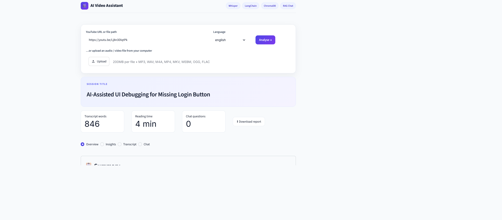

# 🎬 AI Video Assistant

Turn any video or lecture into clear insights. Paste a YouTube link or upload an audio/video file, and get a **transcript, summary, action items, key decisions and open questions**, then **chat with the video** using Retrieval-Augmented Generation (RAG).





## ✨ Features

- **Input:** YouTube URL, local file path, or file upload (mp3, wav, m4a, mp4 and more)
- **Speech-to-text:** OpenAI Whisper running locally, with long audio split into 10-minute chunks
- **Summary:** map-reduce summarisation, so long transcripts fit within the LLM context
- **Extraction:** action items (owner and deadline), key decisions, and open questions
- **Chat with the video:** answers come only from the transcript using a ChromaDB vector store and sentence-transformer embeddings
- **Streamlit web app** with a download button for a full Markdown report
- **Switchable LLM:** Groq, Mistral or Gemini by changing one line in `.env`

## 🧱 How it works

```
YouTube link / file
      │
      ▼
 yt-dlp + ffmpeg ──► audio chunks ──► Whisper ──► transcript
                                                      │
              ┌───────────────────────┬───────────────┴─────────────┐
              ▼                       ▼                             ▼
        Title + summary      Action items, decisions,      Embeddings → ChromaDB
        (LangChain + LLM)    open questions (LLM)          → RAG chat (LLM)
```

## 🛠 Tech stack

Python · Streamlit · OpenAI Whisper · LangChain (LCEL) · Groq / Mistral / Gemini · ChromaDB · Hugging Face sentence-transformers (`all-MiniLM-L6-v2`) · yt-dlp · pydub · ffmpeg

## 🚀 Getting started

### 1. Clone and create an environment
```bash
git clone https://github.com/SusnataB07/AI-Video-Assistant.git
cd AI-Video-Assistant
python -m venv .venv
.venv\Scripts\activate        # Windows
pip install -r Requirements.txt
```

### 2. Install ffmpeg
Install it system-wide (`winget install ffmpeg` on Windows), or place a portable copy at `ffmpeg/bin/ffmpeg.exe` inside the project folder.

### 3. Add your API key
Copy `.env.example`-style settings into a new file named `.env`:
```
LLM_PROVIDER=groq
GROQ_API_KEY=your_key_here
LLM_MODEL=openai/gpt-oss-120b
```
Use `mistral` or `gemini` as `LLM_PROVIDER` with the matching key if you prefer. Model names change over time, so check your provider's current model list.

### 4. Run
```bash
streamlit run app.py      # web app
python main.py            # command-line version
```

## 📁 Project structure

```
AI-Video-Assistant/
├── app.py                # Streamlit web interface
├── main.py               # command-line pipeline
├── core/
│   ├── llm.py            # LLM provider switch (Groq / Mistral / Gemini)
│   ├── transcriber.py    # Whisper transcription
│   ├── summarizer.py     # title + map-reduce summary
│   ├── extractor.py      # action items, decisions, questions
│   ├── vector_store.py   # ChromaDB + embeddings
│   └── rag_engine.py     # RAG chat chain
└── utils/
    └── audio_processor.py  # download, convert, chunk audio
```

## 📝 Notes

- Transcription runs on CPU by default, so it takes a few minutes for short videos. Set `WHISPER_MODEL=base` in `.env` for faster, less accurate results.
- Results come from an LLM and can contain mistakes, so check important details against the transcript.
- Never commit your `.env` file. It is already listed in `.gitignore`.

## 👤 Author

**Susnata Barman**: [GitHub](https://github.com/SusnataB07)
